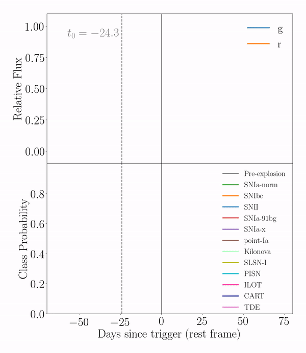

.. astrorapid documentation master file, created by
   sphinx-quickstart on Tue Jan 22 13:32:33 2019.
   You can adapt this file completely to your liking, but it should at least
   contain the root `toctree` directive.

RAPID
=====
RAPID (Real-time Automated Photometric IDentification) can classify multiband photometric light curves into
several different transient classes. It uses a deep recurrent neural network to produce time-varying classifications.

.. toctree::
   :maxdepth: 3
   :caption: Contents:

   installation
   usage
   example
   api

Contribute
----------

- Issue Tracker: https://github.com/daniel-muthukrishna/astrorapid/issues
- Source Code: https://github.com/daniel-muthukrishna/astrorapid

Support
-------

If you are having issues, please let us know by submitting a GitHub issue at https://github.com/daniel-muthukrishna/astrorapid/issues

License
-------

The project is licensed under the MIT license.

Citation
--------

You can cite the following paper for this work: https://ui.adsabs.harvard.edu/abs/2019arXiv190400014M/abstract

Author
------
Daniel Muthukrishna
http://www.danielmuthukrishna.com
